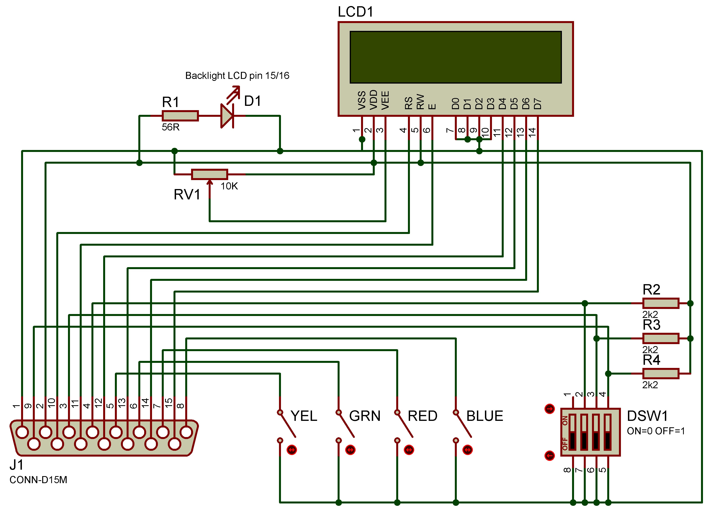
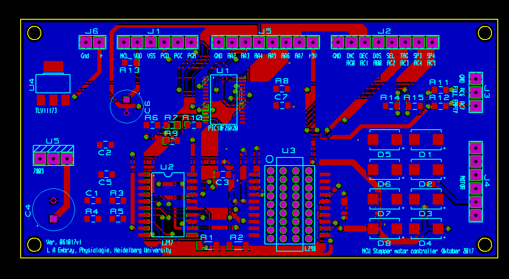

# Adjustable Aperture Gate

## Description

The Adjustable Aperture Gate is designed to produce multiple programmable apertures between two sliding doors for use in rodent behaviour experiments.
The various apertures can be pre programmed using the programming module, the programming module can then be used to test the operations using the DIP switches on it's front panel,
once the programming module is disconnected and the unit connected to experiment controller (external controller) these preset distances between the sliding doors can then be
 recalled using three 5V TTL (Transistor-Transistor-Logic) or 3.3V logic inputs driven by a single board computer (Raspberry Pie or Arduino for example) or any other microprocessor or logic controller.

The unit requires a 12V power supply and three logic control inputs with ground, a simple three bit binary word input will recall the various presets causing the sliding doors to move to the selected distance.

The design has two parts, the **Programming Module** (LCD/Buttons) and the **Gate Unit** (Mechanical/Main PCB) which are connected together using a standard one-to-one 15pin D type male to female cable.
The LCD and switches are mounted in a small housing allowing parameter changes without disturbing the experiment.
The Gate Assembly unit is designed using Google Sketchup and 3D printed using a FormLabs Form 2 SLA (Stereolithografie) 3D printer,
assembly of the mechanical parts is quite labour intensive and modification of the motor for this application requires the use of a lathe.

The Programming Module only needs to be connected to change the preset aperture or to run tests to check operation, all changes are then saved to non volatile memory in the Gate Unit and the Gate
Unit can then run without the programming module.
Therefore only one Programming Module is necessary to operate multiple Gate Units.

## Programming Module

## Parts List 1

|Part | Qty |Part Description  | Manufacturer | Part ID | Order URL |
| ---- | --- | ----------------- | ------------ | ------- | --------- |
| J1 | 1 | DSUB 15M connector | MH Connectors | 746751 | [Conrad](https://www.conrad.de/de/p/mh-connectors-mhdb15-sp-2101-0180-02-d-sub-stiftleiste-180-polzahl-num-15-loetkelch-1-st-746751.html) |okw-soft-case-d9052288-wall-mount-enclosure-desktop-case-73-x-117-x-27-acrylonitrile-butadiene-styrene-lava-volcano-1-531612) |
| LCD1 | 1 | LCD 16x2 White on Blue  | Gleichmann | 183045 | [Conrad](https://www.conrad.com/p/gleichmann-led-component-white-blue-w-x-h-x-d-80-x-36-x-132-mm-ge-c1602b-tmi-jtr-183045) |
| SW1-4 | 4 | Momentary Switch TC-D6SW  | TRU COMPONENTS | 2238782 | [Conrad](https://www.conrad.de/de/p/tru-components-tc-d6sw-impulstaster-35-v-dc-0-01-a-tastend-1-st-1589415.html) |
| DSW1 | 1 | DIP Switch 4 Way  | APEM | 700640 | [Conrad](https://www.conrad.com/p/apem-nds-04-v-dip-switch-standard-700640) |
| R1 | 1 | Resistor 56 Ohm 1/4W | Yageo | 1417715 | [Conrad](https://www.conrad.com/p/yageo-cfr-25jt-52-56r-carbon-film-resistor-56-axial-lead-0207-025-w-5-1-pcs-1417715) |
| R2,3,4 | 3 | Resistor 2.2k Ohm 1/4W | Yageo | 1417683 | [Conrad](https://www.conrad.com/p/yageo-cfr-25jt-52-2k2-carbon-film-resistor-22-k-axial-lead-0207-025-w-5-1-pcs-1417683) |
| RV1 | 1 | Trim Potentiometer 10k Ohm 1/4W  | Vishay | 423980 | [Conrad](https://www.conrad.com/p/vishay-t63yb103kt20-t63yb103kt20-multi-grade-trim-potentiometer-423980) |
| PCB | 1 | Strip Board Paper/Copper 2.54mm | Rademacher | 529531-62 | [Conrad](https://www.conrad.de/de/p/rademacher-wr-typ-710-2-platine-hartpapier-l-x-b-100-mm-x-75-mm-35-m-rastermass-2-54-mm-inhalt-1-st-529531.html) |
| Case | 1 | Case 73x117x27mm  | OKW | 531612 | [Conrad](https://www.conrad.com/p/okw-soft-case-d9052288-wall-mount-enclosure-desktop-case-73-x-117-x-27-acrylonitrile-butadiene-styrene-lava-volcano-1-531612) |

 **Programming Module**

The programming module is created using the following schematic, a small piece of strip board is used to mount the four main switches as shown in the picture below.
All components are mounted directly onto the LCD or switches therefore no PCB is necessary for the programming module.
The potentiometer RV1 is used to adjust the contrast on the LCD and is required to be set only once.
D1 is the backlight that is built into the LCD module and connected using pins 15 and 16 of the LCD module.

 **Programming Module Schematic**

All components are mounted in a plastic housing and necessary holes for the the LCD, switches and connectors are drilled accordingly.

 **Programming Module - Open**

 **Programming Module - Button Mounting**

## Gate Unit

## Parts List 2

|Part | Qty |Part Description  | Manufacturer | Part ID | Order URL |
| ---- | --- | ----------------- | ------------ | ------- | --------- |
| U1 | 1 | Microchip PIC18F23K20 MPU | Microchip  | 666-9860 | [RS Components](https://de.rs-online.com/web/p/mikrocontroller/6669860) |
| U2 | 1 | L297D Stepper Motor Driver SOIC | STMicroelectronics  | 102-3535  | [RS Components](https://de.rs-online.com/web/p/motor-treiber-ics/1023535) |
| U3 | 1 | L298P013TR Dual Full Bridge Driver | STMicroelectronics | 880-5308 | [RS Components](https://de.rs-online.com/web/p/motor-treiber-ics/8805308) |
| U4 | 1 | SMD 3.3V Regulator TLV111733 | Texas Instruments | 923-3827 | [RS Components](https://de.rs-online.com/web/p/spannungsregler/9233827) |
| U5 | 1 | L78S05CV 5V Regulator TO220 | STMicroelectronics  | 179345  | [Conrad](https://www.conrad.de/de/p/stmicroelectronics-l78s05cv-spannungsregler-linear-typ78-to-220ab-positiv-fest-5-v-2-a-179345.html) |
| D1-8 | 8 | Schottkey Diode SK26L | PanJit | 1304995 | [Conrad](https://www.conrad.de/de/p/panjit-schottky-diode-gleichrichter-sk26l-do-214aa-60-v-einzeln-1304995.html) |
| R1,2 | 2 | Resistor SMD 1206 1 Ohm 1/2W | Panasonic | 1473248 | [Conrad](https://www.conrad.de/de/p/panasonic-erj-8bqf1r0v-dickschicht-widerstand-1-smd-1206-0-5-w-1-200-ppm-c-1473248.html) |
| R3 | 1 | Resistor SMD 0805 22k Ohm 1/8W| Tru Components | 1584677 | [Conrad](https://www.conrad.de/de/p/dickschicht-widerstand-22-k-smd-0805-0-125-w-5-100-ppm-c-tru-components-tc-0805s8j0223t5e203-1-st-1584677.html) |
| R5 | 1 | Resistor SMD 0805 3.3k Ohm 1/8W| Tru Components | 1584493 | [Conrad](https://www.conrad.de/de/p/tru-components-tc-0805s8f3301t5e203-dickschicht-widerstand-3-3-k-smd-0805-0-125-w-1-100-ppm-c-1-st-tape-cut-1584493.html) |
| R4,6-13 | 9 | Resistor SMD 0805 2.2k Ohm 1/8W| Tru Components | 1584491 | [Conrad](https://www.conrad.de/de/p/tru-components-tc-0805s8f2201t5e203-dickschicht-widerstand-2-2-k-smd-0805-0-125-w-1-100-ppm-c-1-st-tape-cut-1584491.html) |
| C1 | 1 | Capacitor SMD 0805 3300pF | Thomsen | 460338 | [Conrad](https://www.conrad.de/de/p/thomsen-keramik-kondensator-smd-0805-3300-pf-50-v-10-1-st-tape-cut-460338.html) |
| C2,3,5,7 | 4 | Capacitor SMD 0805 100nF 50V  | Samsung | 454108 | [Conrad](https://www.conrad.de/de/p/samsung-electro-mechanics-cl21b104jbcnnnc-keramik-kondensator-smd-0805-100-nf-50-v-5-4000-st-tape-on-full-reel-454108.html?searchType=SearchRedirect) |
| C4 | 1 | Elecrolytic Capacitor 470uF 16V| Yageo | 445373 | [Conrad](https://www.conrad.de/de/p/yageo-se016m0470b3f-0811-elektrolyt-kondensator-radial-bedrahtet-3-5-mm-470-f-16-v-20-x-h-8-mm-x-12-mm-1-st-445373.html) |
| C6 | 1 | Elecrolytic Capacitor 100uF 16V| Yageo | 445579 | [Conrad](https://www.conrad.de/de/p/yageo-s5016m0100bzf-0605-elektrolyt-kondensator-radial-bedrahtet-2-5-mm-100-f-16-v-20-x-h-6-mm-x-5-mm-1-st-445579.html) |
| J1-6 | 4 | Pin Strip Header 8Pin Male| BKL Electronic | 742235-VQ | [Conrad](https://www.conrad.com/p/bkl-electronic-10120504-straight-nominal-current-details-3-a-742235) |
| J1-6 | 4 | Pin recepticle 8Pin Female | TRU COMPONENTS | 1560801 | [Conrad](https://www.conrad.com/p/tru-components-receptacles-precision-no-of-rows-1-pins-per-row-8-tc-0306pf-008-1-50-00-1-pcs-1560801) |
| J7 | 1 | D15F connector | MH Connectors | 746800 | [Conrad](https://www.conrad.de/de/p/mh-connectors-mhdb15-ss-2101-0180-12-d-sub-buchsenleiste-180-polzahl-num-15-loetkelch-1-st-746800.html) |
| J8 | 1 | Low Power connector Socket 2.1mm 5.5mm | BKL Electronic | 733946 | [Conrad](https://www.conrad.com/p/bkl-electronic-072335-low-power-connector-socket-vertical-vertical-55-mm-21-mm-1-pcs-733946) |
| PSU | 1 | Powersupply 12V 3A  | Mean Well | 1439200 | [Conrad](https://www.conrad.de/de/p/mean-well-gst36e12-p1j-steckernetzteil-festspannung-12-v-dc-3000-ma-36-w-1439200.html) |
| M1 | 1 | Stepper Motor 0.25Nm 0.6A | EMIS | 198398 | [Conrad](https://www.conrad.de/de/p/emis-schrittmotor-103-h5205-0351-103-h5205-0351-0-25-nm-0-6-a-wellen-durchmesser-5-mm-198398.html) |
| SW5,6 | 2 | Microswitch125V AC 3A| Hartmann | 704713 | [Conrad](https://www.conrad.de/de/p/hartmann-mikroschalter-microhart-125-v-ac-3-a-1-x-ein-ein-tastend-1-st-704713.html) |
| Tube 5mm | 1 | Brass Tube 5mmx500mm  | REELY | 221794 | [Conrad](https://www.conrad.com/p/brass-tube-rail-x-l-5-mm-x-500-mm-inside-diameter-3-mm-1-pcs-221794) |
| Rod 6mm | 1 | Silver Steel Rod 6mmx500mm  | REELY | 237086 | [Conrad](https://www.conrad.com/p/reely-silver-steel-shaft-x-l-6-mm-x-500-mm-237086) |
| Collared Bush | 2 | ID-6mm OD-10/15mm  | REELY| 237043 | [Conrad](https://www.conrad.com/p/reely-collared-bush-inside-diameter-6-mm-outside-diameter-10-mm-width-15-mm-1-pcs-237043) |
| Spindle | 1 | RH Threaded Spindle TSR-Tr 5x1.5  | HFB| 12-0515-01 | [HFB](https://hfbshop.de/?cat=c27_TSR-1500mm-Rechts-TSR-1500mm-Rechtsgewinde.html) |
| Spindle | 1 | LH Threaded Spindle TSR-Tr 5x1.5  | HFB| 12-0515-02 | [HFB](https://hfbshop.de/?cat=c30_TSR-1500mm-Links-TSR-1500mm-Linksgewinde.html) |
| Spindle Nut | 1 | RH Nut 5x1.5 | HFB| 33-0515-01 | [HFB](https://hfbshop.de/product_info.php?info=p5076_sechskant-messingmutter-rohling-skm-ms-tr-5x1-5-rechts.html) |
| Spindle Nut | 1 | LH Nut 5x1.5  | HFB| 33-0515-02 | [HFB](https://hfbshop.de/product_info.php?info=p5098_sechskant-messingmutter-rohling-skm-ms-tr-5x1-5-links.html) |
| Bearing | 2 | Radial 3x10x4  | REELY | 215210 | [Conrad](https://www.conrad.com/p/reely-radial-ball-bearing-chrome-steel-inside-diameter-3-mm-outside-diameter-10-mm-rotational-speed-max-60000-um-215210) |
| Cable | 1 | D-Sub15 Cable M-F 1M  | Pheonix Contact | 673800 | [Conrad](https://www.conrad.de/de/p/phoenix-contact-seriell-parallel-anschlusskabel-1x-d-sub-buchse-15pol-1x-d-sub-stecker-15pol-1-00-m-weiss-673800.html) |
| Wire | 1 | Jumper Wire 1x0.2mm  | Tru Components | 1567899 | [Conrad](https://www.conrad.de/de/p/tru-components-1567899-schaltdraht-yv-1-x-0-20-mm-schwarz-100-m-1567899.html) |

## 1. PCB Assembly

PCB Gerber files are supplied allowing production and ordering, the origional Proteus design file is also supplied incase any modifications for specific requirements are necessary.
All components of the PCB are mounted by hand and special attention should be applied to the motor driver (U3) as the underside of the component is used as a heat sink and must be soldered to the PCB,
this is done from the reverse side of the PCB using the through holes integrated on the PCB design. Soldering SMD devices by hand requires some experience.

 
**Main PCB Schematic**

 
**Main PCB Layout**

## 2. Programming

The Microprocessor must be programmed with the included program, this is performed using a Microchip Pickit 3 In-Circuit Debugger/Programmer and the Microchip MPLAB IDE X software.
once the included project is added to the programming software the PicKit programmer can be plugged directly into the J1 on the main PCB and the program uploaded to the microprocessor.

## 3. Parts Preparation

The output shaft of the motor **(22)** requires modification, this is best performed on a lathe, The motor should be carefully dismantled and the rotor removed.

1. Using a lathe the shaft of the rotor should be shortened to the same length as the shorter side of the rotor meaning the assembled motor has no protruding shaft from either side.
2. Using a lathe the complete length of the rotor/shaft should be drilled out using a 2.5mm drill bit mounted in the tailstock,
3. it is very important that the drilling is centered correctly for smooth operation and this can be achieved by using a centre drill first as a guide before the 2.5mm drill bit.
4. Using a lathe an M3 thread must be cut within the hole drilled in step two, the M3 Tap should be mounted in the tailstock and the tailstock should be freely moving on the guide ways,
5. by manually turning the main spindle chuck holding the rotor the thread can be accurately cut through the entire length of the rotor shaft.
6. The motor should now be reassembled paying particular care to making sure there is no small pieces of metal swarf trapped within and all parts are sufficiently clean,
7. any dirt or swarf will cause the motor to jam.

The two Silver Steel Shafts **(17)** should be cut to a length of 202mm, using a lathe the ends of the shafts should be drilled to a depth of 10mm using a 3.3mm drill,
these holes should then be tapped using a M4 tap.

A piece of 5mm brass tube **(6)** should be cut to a length of 72.5mm, this is used to carry and protect the two wires that connect to the end of travel switch **(4)** as shown in the picture below.

The left and right threaded rods (8,18) should be cut to a length of 88mm.

1. Using a lathe 4mm of the ends of the rods should be reduced in diameter to 3mm.
2. Using a lathe, 10mm of the opposite end of the rods should be reduced to a diameter of 3mm.
3. Using a lathe and an M3 die the 10mm end should have a M3 thread cut.

Once all parts are 3D printed a small amount of cleaning/trimming and sanding is required to allow all parts to accurately fit together without force. The following drawing shows all parts for assembly.

The four motor mount holes on the Main Body **(12)** should be counter sunk to allow for flush mounting of the motor allowing the slider **(10)** to travel up against the Main Body **(12)** without obstruction.

 
**Complete Assembly**

## Key To Drawing

1. M4x10mm Screw x4
2. M4 Washer x4
3. Left Slider Stop
4. End of Travel Micro Switch
5. Bearing Radial 3x10x4 x2
6. Brass Tube 5x72.5mm
7. Collared Bush 6x10x15mm x8
8. Left Hand Threaded Rod
9. Left Handed Brass Nut 5x1.5
10. Left Slider
11. Start of Travel Micro Switch
12. Main Body
13. Mounting Clamp
14. D15 Female Connector
15. Assembled Printed Circuit Board
16. PCB Cover
17. Silver Steel Shaft 6x202mm x2
18. Right Hand Threaded Rod
19. Right Handed Brass Nut 5x1.5
20. Right Slider
21. Right Slider Stop
22. Motor

## 4. Assembly of parts

1. The Motor **(22)** is inserted into the Main Body **(12)** and fixed in place with the wires facing upwards using four M3x10 counter sunk screws.

2. The two Silver Steel Shafts **(17)** are inserted into the Main Body **(12)** with equal lengths of the shaft protruding from each side of the Main Body **(12)**,
these should now be fixed in place using cyanoacrylate glue being careful not to get any excess glue on the Shafts **(17)**.

3. The two End Stop Microswitches **(4/11)** should be prepared by soldering two 0.05mm wires of 15cm length to each of of the Microswitches normally open contacts(no).

4. One Microswitch **(11)** can now be mounted into its cutout on the Main Body **(12)** and the wires threaded through to the PCB cavity inside the Main Body **(12)**,
the second Microswitch can now be inserted into the cutout on the Left Slider Stop **(3)** and the wires threaded through the channel inside the Left Slider Stop **(3)**,
for the time being the wires should be left long and will later be attached.

5. The eight Collared Bushes **(7)** should be carefully pressed into the Left and Right Sliders **(10/20)**, it is important that these are inserted straight and true,
this is best done using either a press or a machine vice using a scrap piece of the 6mm silver steel shaft as a guide,
opposing bushes should be pressed into place at the same time with the 6mm shaft inserted into both bushes as this will guarantee alignment during insertion.

6. The Left Handed and Right Handed Threaded rods **(8/18)** can now be attached to the Motor **(22)**,
the 10mm of M3 thread on the threaded rod should be screwed into the motors shaft using thread lock to be sure they don't unscrew.

7. The two Bearings **(5)** are to be pressed into the Left and Right Slider stops **(3/21)** this is easily accomplished using a machine or bench vice.

8. The Left and Right Hand Threaded Brass Nuts **(9/19)** can be installed into the Left and Right Sliders **(10/20)**,
the nuts should not be a tight fit but also should not have any excessive play as this will affect the accuracy of the aperture,
however a small amount of movement must be available to allow for slight inaccuracies in the Threaded Rods **(8/18)**.

9. The two Sliders **(10/20)** can now be slid onto the two Silver Steel Shafts **(17)** and with the Left and Right Handed Brass nuts **(9/19)** held in place can be slid until the
Brass Nuts come into contact with the Left and Right Handed Threaded Rods **(8/18)**.

10. By applying a small amount of pressure to both Sliders **(10/20)** and turning the Motor Shaft both the sliders will be drawn in towards the motor,
it is important that both Sliders arrive at the Main Body **(12)** at the same time, the Microswitch **(11)** should be heard to click just before the Sliders come into hard contact with the Main Body.

11. The Right Slider Stop **(21)** can now be fitted to the end of the Silver Steel Shaft **(17)** paying attention that the end of the Right Hand Threaded rod **(18)** is inserted into the
Bearing **(5)**, This can now be fixed in place using two M4x10 screws and washers **(1/2)** holding the Slider Stop to the two Shafts.

12. The Left Slider Stop **(3)** is mounted in exactley the same way with one exception,
the wires from the End Stop Microswitch **(4)** which were earlier threaded though the Left Slider Stop should now be threaded through the Brass Tube **(6)** and as the slider stop is brought into
place this tube should be inserted into the available holes on the Left Slider Stop **(3)** and the Main Body **(12)**, approximately 2.5mm of each end of the Brass Tube should be inserted.
The microswitch wire should be threaded through to the Main Body PCB cavity. The Slider Stop should be fixed into place using two M4x10 screws and washers **(1/2)**.

13. By turning the Motor/Threaded Rods the assembly can be checked for smooth operation and that the microswitches are pressed before the sliders make hard contact at either end of their travel,
a small amount of machine oil or grease should be applied to the threaded rods and also to the silver steel shafts.

14. The PCB **(15)** can now be placed within the cavity in the Main Body **(12)** with the wires from the two Microswitches **(4/11)** and Motor **(22)** exiting above the PCB.
The PCB **(15)** is a tight fit inside the Main Body **(12)** and does not require and additional fixing.

15. The wires from the Motor **(22)** should be cut and spliced (shortened) to a length that easily reaches the motor connector **(J4)** at the top of the PCB **(15)** without too much excess length,
this is now plugged into the motor connector **(J4)**.

16. The wires from the End Stop Microswitches **(4/11)** should be shortened and soldered to three pins of the female recepticle as shown in the diagram below,
this is then plugged into the end stop connector on the PCB **(J3)**.

17. The D15F **(J7)** is be prepared by soldering 10cm of wire on to each of the 15 pins,
this can then be mounted into the Main Body **(12)** with the wires exiting from the bottom of the PCB **(15)**,
the wires should then be connected to strips of female receptacle as shown in the diagram below, this can then be plugged into **(J5/J2)** on the PCB.

18. The Low power connector **(J8)** is prepared by soldering two wires (red and black) to the connector, The red wire is connected to the centre pin of the connector and the black to the ring,
the wires should exit inside the Main Body at the bottom of the PCB and shortened so that they easily reach the power connector on the PCB and then soldered to two pins of a female receptacle,
this can then be plugged into the power connector **(J6)** on the PCB.
The PCB **(15)** is a tight fit inside the Main Body **(12)** and does not require and additional fixing.

 
**Connections to PCB**

 
**Connections to PCB**

The gates themselves should be made to fit individual requirements, the gate holders on the sliders have been designed to accept 1mm aluminium sheet and fixed in placed using M3x25 screws and nuts.

## 5. Menus

 Once the power supply and programming module are connected the LCD will illuminate and the program will initiate. A simple menu structure for the operation is shown below.

 
**The first menu shows that the unit is running and waiting for an input change.**
Pressing SETUP will enter the function to adjust the presets of the different positions starting with position 0.**

 
**Pressing NEXT will change the selection to position 1 and then 2 up to position 7.**

 
**Pressing SEL on the selected position to be changed will enter the function to set the value for that preset.**

 
**Pressing + or - on the selected position will change the numerical value in millimeters for that position, pressing SEL to confirm will save this value to memory.**

## 6. Operation

Once the required presets have been entered using the Programming Module the positions can be checked using the DIP switches on the programming module.
The Gate Unit can be de-powered and the Programming Module removed, all parameters will be saved to Non-Volatile Memory.

Position 3 has been preset in the program to **Fake Move** and this mode will cause the doors to move away from the current position and then return to this position,
this has been done incase the sound of the motor creates a false stimulus/cue for the animal performing the experiment.
Position 7 is reserved and will always cause the doors to return **Home** thus closing the doors completely.
The two reseved positions can be modified in the program to allow eight user definable positions.

Using the diagram below a control cable can be built to allow the Gate Unit to be connected to a controller of choice as long as the controller presents a 3.3v or 5v 3bit logic output

The three bit binary logic inputs are as follows:

|Logic Input | Position Number  | Position |
| ---- | ----------------- | ----------- |
| 000 | Position 0 | User Definable 0-55mm |
| 001 | Position 1 | User Definable 0-55mm |
| 010 | Position 2 | User Definable 0-55mm |
| 011 | Position 3 | Fake Move |
| 100 | Position 4 | User Definable 0-55mm |
| 101 | Position 5 | User Definable 0-55mm |
| 110 | Position 6 | User Definable 0-55mm |
| 111 | Position 7 | Home/Closed |

 
**Control Pin Out for External Controller**

Once the power is re-applied the gates will follow the given logic inputs.

## Mounts

The Main Body **(12)** has been design for mounting on a 30x15mm rectangular steel tube present in our personal setup, the clamp **(13)** is screwed down tightly to achieve a tight fit,
the drawing can be modified before printing to allow for any other types of mounting requirements, orientation or position.

 
**Installed aperture gate**
