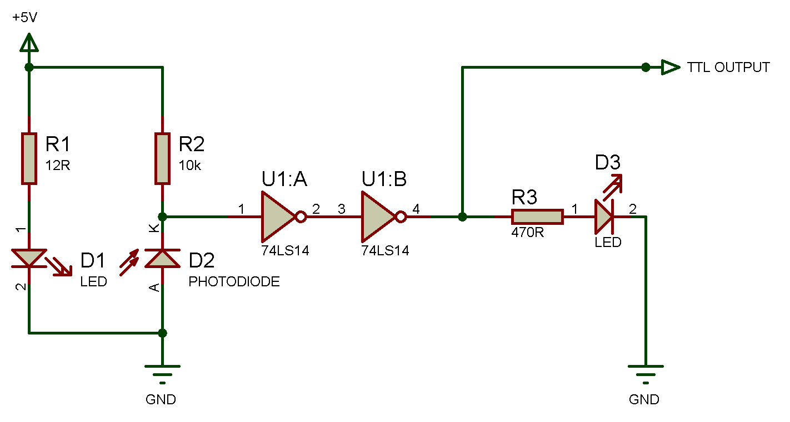
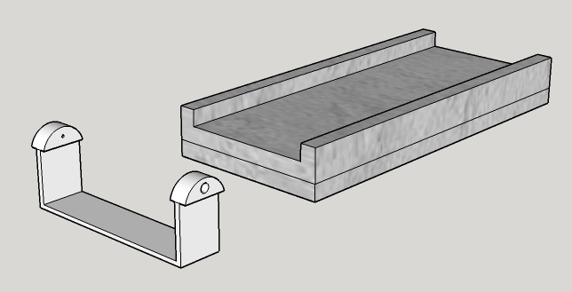

# Light Barrier

## 1. Description

The light barrier is designed to detect any interruption in the light path between the LED (light emmiting diode) emitter and the Photo transistor and convert this interruption into a TTL-compatible
logic level (Transistor-Transistor-Logic ) output for the duration of the interruption.

The light barrier has many applications for the detection of movement of many different things such as people, animals, mechanical parts or to stop a motor in a required preset position for example.
The TTL output can  be used to control other logical operations either in discreet electronics or using microprocessors and single board computers such as the Raspberry Pie or  Arduino as an example.
Most modern processors run on 3.3V but are tolerant of TTL levels which are 5V. If the higher 5V can not be tolerated then a level shifter should be added to the schematic.

## 2. Parts List

|Part | Part Description  | Manufacturer | Part ID | Order URL |
| ---- | ----------------- | ------------ | ------- | --------- |
| U1 | 74LS14 Hex Schmitt-Trigger Inverter | Texas Instruments  | 812261982 | [Conrad](https://www.conrad.de/de/p/high-speed-cmos-hex-inverter-schmitt-trigger-dip-14-812261982.html) |
| D1 |  L-53F3BT IR-Emitter 940nm 30 ° 5 mm LED | Kingbright  | 154434  | [Conrad](https://www.conrad.de/de/p/kingbright-l-53f3bt-ir-emitter-940-nm-30-5-mm-radial-bedrahtet-154434.html) |
| D2 | L-53P3C Phototransistor 940nm 5 mm | Kingbright | 154527 | [Conrad](https://www.conrad.de/de/p/kingbright-fototransistor-5-mm-1100-nm-l-53p3c-154527.html) |
| D3 | HLMP-3301 Red 5 mm LED | Broadcom | 180620-62 | [Conrad](https://www.conrad.de/de/p/broadcom-hlmp-3301-led-bedrahtet-rot-rund-5-mm-7-mcd-60-10-ma-1-9-v-180620.html) |
| R1 | Carbon Film Axial Resistor 12 Ohm 0.25W | Yageo | 1417661-62 | [Conrad](https://www.conrad.de/de/p/yageo-cfr-25jt-52-12r-kohleschicht-widerstand-12-axial-bedrahtet-0207-0-25-w-5-1-st-1417661.html) |
| R2 | Carbon Film Axial Resistor 10k Ohm 0.25W | Yageo | 1417697-62 | [Conrad](https://www.conrad.de/de/p/yageo-cfr-25jt-52-10k-kohleschicht-widerstand-10-k-axial-bedrahtet-0207-0-25-w-5-1-st-1417697.html) |
| R3 | Carbon Film Axial Resistor 470 Ohm 0.25W | Yageo | 1417694-62 | [Conrad](https://www.conrad.de/de/p/yageo-cfr-25jt-52-470r-kohleschicht-widerstand-470-axial-bedrahtet-0207-0-25-w-5-1-st-1417694.html) |
| PCB | Strip Board Paper/Copper 2.54mm | Rademacher | 529531-62 | [Conrad](https://www.conrad.de/de/p/rademacher-wr-typ-710-2-platine-hartpapier-l-x-b-100-mm-x-75-mm-35-m-rastermass-2-54-mm-inhalt-1-st-529531.html) |

 
**Schematic of single channel Light Barrier**

## 3. Functionality

The 74LS14 is a high-speed CMOS(complimentory metal oxide silicon) Hex Schmitt-Trigger-Invertor, Hex meaning the IC contains six separate Inverting gates all using Schmitt-Trigger technology.
As the IC(integrated circuit) gates invert the signal two have been placed in series to provide a logic high (1) output when the light beam is interrupted and a logic low (0) when uninterrupted.

 The Schmitt-Trigger technology allows the analogue signal from the Photo transistor to be converted to a clean jitter free digital output using the Schmitt-Triggers inherent comparator hysteresis.
 The typical time for the operation of a single invertor is 15 nS, as two are used in series with this circuit the propogation delay is typically 30 nS.

The schematic shown has been designed to provide a single channel light barrier and to operate on 5V using only two of the six invertors contained in the IC package,
as the IC contains six invertors it is possible to create three channels of light barrier per IC resulting in a very cost efficient and simple to build solution.

D3 is a simple red LED to show the current state of the output,
while this is useful for setting up or fault finding it can be ommitted from the schematic along with its resistor R3 especially if current usage is of concern.

Because of the simplicity of the circuit it is suggested that it is built on prototyping strip board but a PCB could also be easily created to provide as many channels as required.

The 5V supply is not included in the design as this can be obtained from various sources such as a spare USB output or simply an "off the shelf" power supply readily available from many electronic suppliers.

## 4. Mounting

For our use a mounting bracket was developed to be able to place  the light barrier at any position on our behaviour setup track,
the 5mm LEDs are simply placed within the holes either side of the bracket creating a beam across the track, the CAD drawing is included and can be modified for individual requirements.

 
**LED Mounting bracket and a section of our setup to demonstrate mounting.**
